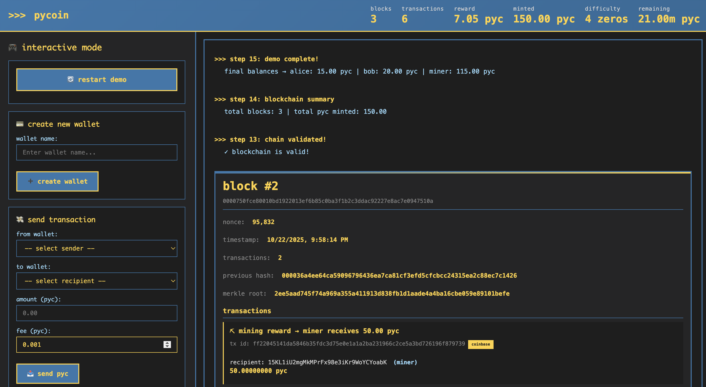

# PyCoin - Learn Cryptocurrency by Building It

<div align="center">

**An educational cryptocurrency implementation in Python**

*Understanding blockchain technology by implementing it from scratch*



[Features](#-features) • [Quick Start](#-quick-start) • [How It Works](#-how-it-works) • [Architecture](#️-architecture) • [Visualization](#-visualization)

</div>

---

## 🎯 What is PyCoin?

PyCoin is a **fully functional cryptocurrency** implementation in Python, designed for learning. By studying this codebase, you'll understand exactly how Bitcoin and other cryptocurrencies work under the hood.

### Why PyCoin?

- ✅ **Complete Implementation** - All core blockchain concepts
- ✅ **21 Million Coin Cap** - Bitcoin-style halving mechanism
- ✅ **Real Cryptography** - ECDSA signatures, SHA-256 hashing
- ✅ **Working Demo** - See it in action immediately
- ✅ **Browser Visualization** - Beautiful blockchain explorer
- ✅ **Educational** - Every concept explained clearly

---

## 🚀 Quick Start

### Installation

```bash
# 1. Clone the repository
git clone git@github.com:thomasinworld/pycoin.git
cd pycoin

# 2. Create virtual environment (recommended)
python3 -m venv venv
source venv/bin/activate  # Windows: venv\Scripts\activate

# 3. Install dependencies
pip install -r requirements.txt
```

### Run the Demo (Super Easy!) 🎬

```bash
# That's it! Just one command:
python demo.py
```

**What happens:**
- ✨ **Opens your browser automatically** (http://localhost:7777)
- 📺 **Python-themed terminal interface** (blue/yellow colors)
- 📝 **Newest updates at top** (no scrolling to see latest!)
- ⛏️ **Blocks appear as they're mined** (stacked vertically)
- 💰 **Live stats in header** (blocks, transactions, supply, etc.)
- 🎮 **Interactive mode** after demo completes

**Layout:**
```
┌───────────────────────────────────────┐
│ >>> pycoin  | stats (live)           │
├──────────────┬────────────────────────┤
│  Sidebar     │  Terminal Output       │
│  (locked)    │  (newest at top)       │
│  🔄 restart  │  ↓ scroll for history  │
│  💳 wallets  │                        │
│  💸 send     │                        │
│  ⛏ mine      │                        │
└──────────────┴────────────────────────┘
```

**Interactive Features** (after initial demo):
- Create new wallets
- Send PYC between wallets
- Mine blocks with any wallet
- Validate blockchain
- Show wallet balances
- View blockchain info
- Restart demo from scratch

Press `Ctrl+C` when done to stop the server.

---

## ✨ Features

### Core Blockchain Features

| Feature | Description |
|---------|-------------|
| **Proof of Work** | SHA-256 mining with adjustable difficulty |
| **Digital Signatures** | ECDSA (secp256k1) for transaction signing |
| **Merkle Trees** | Efficient transaction verification |
| **UTXO Model** | Unspent transaction output tracking |
| **21M Coin Cap** | Bitcoin-style supply limit with halving |

### Currency Details

- **Name**: PyCoin
- **Ticker**: PYC
- **Base Unit**: guido (named after Guido van Rossum, Python's creator)
- **Conversion**: 1 PYC = 100,000,000 guidos
- **Max Supply**: 21,000,000 PYC
- **Initial Reward**: 50 PYC per block
- **Halving**: Every 210,000 blocks (same as Bitcoin)

---

## 📚 How It Works

### 1. Cryptographic Keys & Addresses

**Concept**: Every wallet needs a private key (secret) and public key (shareable).

```python
# Generate a new wallet
from core import Wallet

wallet = Wallet()
print(f"Address: {wallet.address}")
print(f"Private Key: {wallet.private_key.to_hex()}")
```

**What's Happening**:
1. **Private Key**: Random 256-bit number (your secret!)
2. **Public Key**: Derived from private key using ECDSA elliptic curve
3. **Address**: Hash of public key, Base58Check encoded

**Why It Matters**: 
- Private key = ownership (keep it secret!)
- Public key = verification
- Address = easy-to-share identifier

---

### 2. Transactions

**Concept**: Transfer value from one address to another with cryptographic proof.

```python
# Alice sends 5 PYC to Bob
transaction = alice.send(blockchain, bob.address, 5.0)
```

**Transaction Structure**:
```
Transaction
├── Inputs (spending previous outputs)
│   └── Reference to previous transaction + signature
├── Outputs (creating new outputs)
│   ├── Recipient address + amount
│   └── Change address + remaining amount
└── Signatures (proving ownership)
```

**UTXO Model** (Unspent Transaction Outputs):
- Unlike bank accounts, crypto uses "coins" that can be spent
- Each transaction spends entire UTXOs and creates new ones
- Like spending a $20 bill and getting change

**Example**:
```
Alice has: 20 PYC (from previous transaction)
Alice sends Bob: 5 PYC

Input:  [20 PYC from TX#123]
Output: [5 PYC to Bob] + [14.999 PYC back to Alice] + [0.001 fee]
```

---

### 3. Mining & Proof of Work

**Concept**: Secure the network by solving computational puzzles.

```python
# Mine a block
block = blockchain.mine_pending_transactions(miner.address)
```

**What's Happening**:
1. Collect pending transactions
2. Create block header with:
   - Previous block hash
   - Merkle root of transactions
   - Timestamp
   - Difficulty target
   - **Nonce** (number you're trying to find)
3. Hash the header repeatedly, changing nonce each time
4. Find a hash that starts with N zeros (e.g., `0000abcd...`)
5. First miner to find valid nonce wins the block reward!

**Why Proof of Work?**
- Makes it expensive to attack the network
- Creates consensus without central authority
- Secures transaction history

**Difficulty Example**:
```
Difficulty 1: Hash must start with 0
Difficulty 4: Hash must start with 0000
Difficulty 10: Hash must start with 0000000000

Higher difficulty = More attempts needed = More secure
```

---

### 4. The Blockchain

**Concept**: Chain of blocks, each linked to the previous one.

```
Block #0 (Genesis)
  Hash: 0000abc123...
  Previous: 0000000000...
  Transactions: [Coinbase → Miner: 50 PYC]
         ↓
Block #1
  Hash: 0000def456...
  Previous: 0000abc123...  ← Links to Block #0
  Transactions: [Alice → Bob: 5 PYC, ...]
         ↓
Block #2
  Hash: 0000ghi789...
  Previous: 0000def456...  ← Links to Block #1
  Transactions: [...]
```

**Why Chains Are Secure**:
- Each block contains hash of previous block
- Changing any block changes its hash
- This breaks the chain for all subsequent blocks
- Would need to re-mine entire chain (computationally infeasible!)

---

### 5. Supply Cap & Halving

**Concept**: Limit total supply like Bitcoin (21 million coins).

```python
def get_block_reward(block_height):
    halvings = block_height // 210000
    return 50_00000000 >> halvings  # Halve reward
```

**Halving Schedule**:
```
Blocks 0 - 209,999:         50 PYC per block
Blocks 210,000 - 419,999:   25 PYC per block
Blocks 420,000 - 629,999:   12.5 PYC per block
Blocks 630,000 - 839,999:   6.25 PYC per block
...
After ~64 halvings:         0 PYC (all mined)
```

**Total Supply**:
```
210,000 × 50 = 10,500,000 PYC
210,000 × 25 = 5,250,000 PYC
210,000 × 12.5 = 2,625,000 PYC
...
Total ≈ 21,000,000 PYC
```

---

## 🏗️ Architecture

### Project Structure

```
pycoin/
├── core/                      # 🧠 Core blockchain implementation
│   ├── __init__.py           # Package initialization
│   ├── crypto.py             # 🔐 Cryptographic utilities
│   ├── keys.py               # 🔑 Key generation & addresses
│   ├── transaction.py        # 💸 Transaction structure
│   ├── block.py              # 📦 Block & merkle trees
│   ├── blockchain.py         # ⛓️ Blockchain management
│   └── wallet.py             # 👛 Wallet functionality
├── demo.py                   # 🎬 Complete demonstration
├── visualize.html            # 📊 Browser visualization
├── requirements.txt          # 📋 Python dependencies
└── README.md                 # 📖 This file
```

### File Responsibilities

#### `crypto.py` - Cryptographic Building Blocks
```python
# Hash functions
sha256(data)           # Single SHA-256 hash
double_sha256(data)    # SHA-256(SHA-256(data)) - used in Bitcoin
hash160(data)          # RIPEMD160(SHA-256(data)) - for addresses

# Encoding
base58_encode(data)    # Human-friendly encoding
base58check_encode()   # With checksum (for addresses)
```

**Why These Functions?**
- **SHA-256**: Cryptographic hash (one-way, collision-resistant)
- **Double SHA-256**: Extra security layer
- **RIPEMD-160**: Shorter hash for addresses
- **Base58**: Like Base64 but without confusing characters (0, O, I, l)

---

#### `keys.py` - Identity & Ownership
```python
class PrivateKey:
    """Your secret key - proves ownership"""
    - Generate from random 256-bit number
    - Sign transactions
    - Export as hex or WIF format

class PublicKey:
    """Derived from private key - verifies signatures"""
    - Derive from private key using SECP256k1
    - Verify signatures
    - Generate address
```

**Key Generation Process**:
```
Random 256 bits
    ↓ (ECDSA SECP256k1)
Public Key (512 bits)
    ↓ (SHA-256 + RIPEMD-160)
Hash (160 bits)
    ↓ (Base58Check)
Address (1A1zP1e...)
```

---

#### `transaction.py` - Value Transfer
```python
class Transaction:
    """Transfer of value between addresses"""
    - inputs: List of UTXOs being spent
    - outputs: List of new UTXOs being created
    - signatures: Cryptographic proofs of ownership
    
    Methods:
    - sign_input(): Sign with private key
    - verify_input(): Check signature is valid
    - calculate_hash(): Get transaction ID
```

**Transaction Lifecycle**:
1. **Create**: Specify inputs (what you're spending) and outputs (where it goes)
2. **Sign**: Prove you own the inputs with private key
3. **Broadcast**: Add to pending transaction pool
4. **Mine**: Include in a block
5. **Confirm**: Block added to chain = transaction confirmed

---

#### `block.py` - Transaction Container
```python
class Block:
    """Container for transactions with proof-of-work"""
    - index: Block height in chain
    - transactions: List of transactions
    - previous_hash: Links to previous block
    - merkle_root: Summary of all transactions
    - nonce: Proof-of-work solution
    - timestamp: When block was mined
    
    Methods:
    - mine(): Find valid nonce (proof-of-work)
    - calculate_hash(): Get block hash
    - is_valid_proof(): Check if hash meets difficulty
```

**Merkle Tree**:
```
                Root
               /    \
          Hash01    Hash23
           /  \      /  \
       Hash0 Hash1 Hash2 Hash3
         |     |     |     |
       TX0   TX1   TX2   TX3
```

**Benefits**:
- Verify any transaction without downloading entire block
- Efficient proof that transaction is in block
- Used by light clients (SPV)

---

#### `blockchain.py` - The Chain
```python
class Blockchain:
    """Manages the entire blockchain"""
    - chain: List of blocks
    - pending_transactions: Waiting to be mined
    - utxo: Unspent outputs (available to spend)
    - difficulty: Mining difficulty
    - halving_interval: Blocks until reward halves
    
    Methods:
    - add_transaction(): Validate and add to pool
    - mine_pending_transactions(): Create new block
    - validate_chain(): Check entire chain is valid
    - get_balance(): Calculate address balance from UTXOs
```

**Validation Rules**:
1. Genesis block is valid
2. Each block's previous_hash matches previous block's hash
3. Each block's hash meets difficulty target
4. All transactions in block are valid
5. No double-spending (each UTXO spent only once)

---

#### `wallet.py` - User Interface
```python
class Wallet:
    """User's interface to blockchain"""
    - private_key: Secret key
    - public_key: Public key
    - address: Public address
    
    Methods:
    - send(): Create and sign transaction
    - get_balance(): Check current balance
    - create_transaction(): Build transaction from UTXOs

class WalletManager:
    """Manage multiple wallets"""
    - Create multiple wallets
    - Track balances
    - Save/load wallet data
```

---

## 📊 Visualization

The `visualize.html` provides a beautiful, live blockchain visualization:

### Design:
- 🎨 **Python Theme** - Blue (#3776ab) and yellow (#ffd43b) colors
- 💻 **Terminal Aesthetic** - Monospace font (Consolas), dark background
- 📱 **Full Viewport Layout** - No wasted space, everything on one screen

### Live Statistics (Sticky Header):
- **Blocks** - Total blocks mined
- **Transactions** - All transactions across all blocks
- **Reward** - Current mining reward (halves every 210k blocks)
- **Minted** - Total PYC in circulation (from actual coinbase rewards)
- **Difficulty** - Current proof-of-work difficulty
- **Remaining** - PYC left until 21M cap

### Terminal Output (Center Panel):
- **Newest at Top** - Latest updates always visible, no scrolling needed
- **Chronological Steps** - Every action logged (wallets, transactions, mining, validation)
- **Block Details** - Full hashes, nonces, timestamps, Merkle roots
- **Transaction Narratives** - "alice sends 5 pyc to bob (address1 → address2)"
- **Wallet Names** - Addresses shown with names: "1A2b3C4d... (alice)"

### Interactive Sidebar (Left):
- **🔒 Locked Until Demo Completes** - Visible but disabled during initial demo
- **🔄 Restart Demo** - Full reset and rerun from scratch
- **💳 Create Wallet** - Add new wallets dynamically
- **💸 Send Transaction** - Transfer PYC between any wallets
- **⛏ Mine Block** - Process pending transactions
- **✓ Validate Chain** - Check blockchain integrity
- **👛 Show Wallets** - Display all wallet balances
- **📊 Blockchain Info** - View chain statistics

### Real-Time Features:
- Updates every second during demo
- All stats calculated from actual blockchain data
- Blocks appear immediately when mined
- Steps appear instantly when actions occur
- No page reloads needed
- Restart reruns entire demo in place

### Usage:
```bash
# Just run the demo - browser opens automatically!
python demo.py

# The visualization:
# 1. Opens at http://localhost:7777/visualize.html
# 2. Runs initial 15-step demo (wallets, transactions, mining)
# 3. Unlocks interactive sidebar after demo completes
# 4. You can create wallets, send PYC, mine blocks, etc.
# 5. Click restart to run demo again from scratch
```

---

## 🧪 Educational Examples

### Example 1: Create a Wallet
```python
from core import Wallet

# Generate new wallet
wallet = Wallet()

print(f"Address: {wallet.address}")
print(f"Private Key: {wallet.private_key.to_hex()}")
print(f"Public Key: {wallet.public_key.to_hex()}")

# Save for later
wallet.save_to_file('my_wallet.json')

# Load existing wallet
wallet = Wallet.load_from_file('my_wallet.json')
```

### Example 2: Create & Mine Blockchain
```python
from core import Blockchain, Wallet

# Create blockchain
blockchain = Blockchain(difficulty=4)

# Create miner wallet
miner = Wallet()

# Mine genesis block
blockchain.create_genesis_block(miner.address)

print(f"Miner balance: {miner.get_balance_btc(blockchain)} PYC")
# Output: Miner balance: 50.0 PYC
```

### Example 3: Send Money
```python
from core import Wallet, Blockchain

# Create wallets
alice = Wallet()
bob = Wallet()
miner = Wallet()

# Setup blockchain
blockchain = Blockchain(difficulty=4)
blockchain.create_genesis_block(miner.address)

# Miner sends Alice 10 PYC
tx = miner.send(blockchain, alice.address, 10.0)

# Mine the transaction
blockchain.mine_pending_transactions(miner.address)

# Check balances
print(f"Alice: {alice.get_balance_btc(blockchain)} PYC")
print(f"Miner: {miner.get_balance_btc(blockchain)} PYC")
```

### Example 4: Validate Blockchain
```python
# Check if chain is valid
is_valid = blockchain.validate_chain()
print(f"Blockchain valid: {is_valid}")

# Try to tamper with a transaction
blockchain.chain[1].transactions[0].outputs[0].amount = 1000000
is_valid = blockchain.validate_chain()
print(f"Blockchain valid after tampering: {is_valid}")
# Output: False (merkle root won't match!)
```

---

## 🎓 Learning Path

### Beginner
1. Run `demo.py` and observe the output
2. Open `visualize.html` to see the blockchain
3. Read through `keys.py` to understand addresses
4. Experiment with creating wallets

### Intermediate
1. Study `transaction.py` - understand UTXO model
2. Read `block.py` - learn about merkle trees
3. Modify difficulty in demo, observe mining time
4. Try creating your own transactions

### Advanced
1. Implement script language (Bitcoin Script)
2. Add P2P networking
3. Implement SPV (Simplified Payment Verification)
4. Add segwit or other Bitcoin improvements

---

## 🔐 Security Notes

⚠️ **This is educational software!** Do NOT use for real value:

- Not audited for security
- No peer-to-peer networking
- No protection against common attacks
- Simplified cryptography implementation
- No wallet encryption

For production cryptocurrency, use established implementations like Bitcoin Core.

---

## 🤝 Contributing

This is an educational project! Contributions welcome:

- 🐛 Bug fixes
- 📝 Documentation improvements
- ✨ New educational features
- 🎨 Visualization enhancements

---

## 📖 Learn More

### Bitcoin Resources
- [Bitcoin Whitepaper](https://bitcoin.org/bitcoin.pdf) - Original Satoshi Nakamoto paper
- [Mastering Bitcoin](https://github.com/bitcoinbook/bitcoinbook) - Comprehensive guide
- [Bitcoin Developer Guide](https://developer.bitcoin.org/devguide/) - Technical details

### Cryptography
- [Elliptic Curve Cryptography](https://en.wikipedia.org/wiki/Elliptic-curve_cryptography)
- [ECDSA](https://en.wikipedia.org/wiki/Elliptic_Curve_Digital_Signature_Algorithm)
- [SHA-256](https://en.wikipedia.org/wiki/SHA-2)

### Python
- [Python Cryptography](https://cryptography.io/)
- [ecdsa Library](https://github.com/tlsfuzzer/python-ecdsa)

---

## 📜 License

MIT License - Feel free to use for learning!

---

<div align="center">

**Made with ❤️ for learning**

⭐ Star this repo if it helped you understand cryptocurrency!

[Report Bug](https://github.com/thomasinworld/pycoin/issues) • [Request Feature](https://github.com/thomasinworld/pycoin/issues)

</div>
